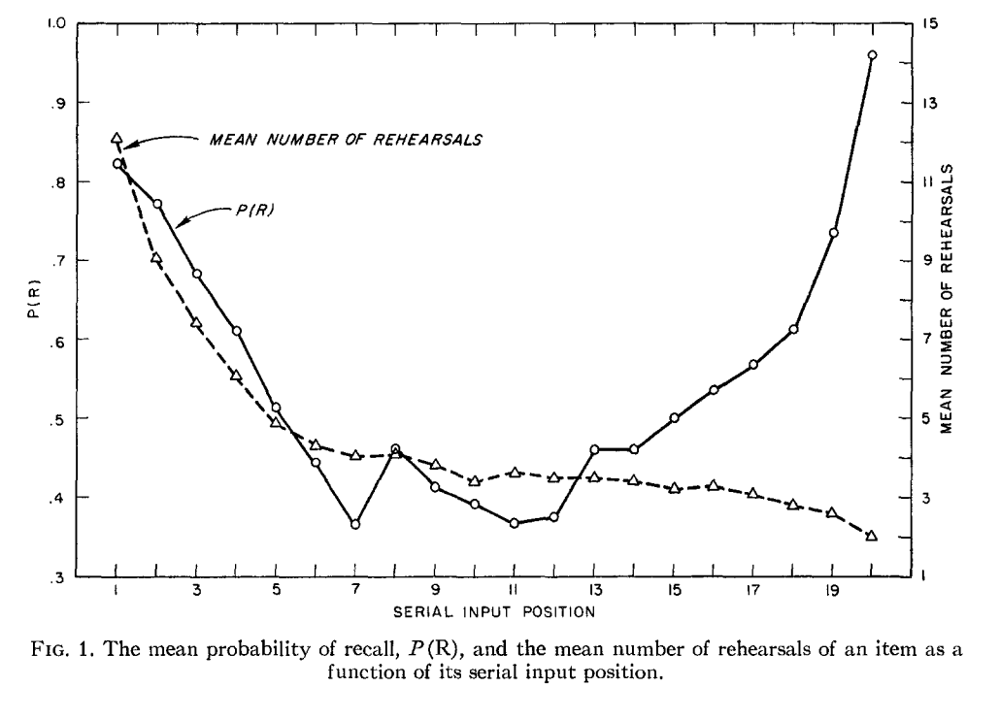

#### Simulation 3

In this simulation we attempt to reproduce the results of Rundus' 1971 experiment
<a href="" onclick="customHref('references#rundus-1971');">(Rundus, 1971)</a>.

According to the experimental data Rundus found that there is a U-shaped
pattern in recall with rehearsal. In other words, he found support 
for the recency and primacy effect in his study design.

 _Figure 6: Data graph from original study._

Our model did not reproduce the same U-shape in recall as demonstrated in the output below.
